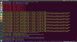
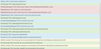

## Description:

 Monitor android
 
[](https://nodei.co/npm/logcat-browser/) 
[](https://nodei.co/npm/logcat-browser/)

[](https://www.npmjs.com/package/logcat-browser)
[](https://www.npmjs.com/package/logcat-browser)
[](https://www.npmjs.com/package/logcat-browser)
[](https://www.npmjs.com/package/logcat-browser)
[](http://packagequality.com/#?package=logcat-browser)
[](http://inch-ci.org/github/HansHammel/logcat-browser)
[](https://github.com/HansHammel/logcat-browser)
[](https://github.com/HansHammel/logcat-browser/fork)

[](https://david-dm.org/HansHammel/logcat-browser)
[](https://david-dm.org/HansHammel/logcat-browser)
[](https://david-dm.org/HansHammel/logcat-browser)
[](https://david-dm.org/HansHammel/logcat-browser)

## How to start using:

 install:

    $ npm install -g logcat-browser

 use

    $ logcat-browser

## Screen shots:

 In console:

[  ](screenshot/console.png)

 In browser, open <http://localhost>:

[  ](screenshot/web.png)

## You can edit app.js:

  * Change default command 'adb logcat'
  * Change default port(80)
  * Add any string in `state` variable as you want
  * ...

```js
var util = require('util'),
	colors = require('colors'),
	app = require('express.io')(),
	spawn = require('child_process').spawn,
	state = {
		'success': ['success', 'D\/DroidGap', 'D\/CordovaLog'],
		'error': ['error', 'E\/'],
		'warning': ['warning', 'W\/Web Console'],
		'info': ['info']
	},
	logcat = spawn('adb', ['logcat']);

app.http().io();
app.get('/', function(req, res) {res.sendfile(__dirname + '/public/client.html');});
app.get('/js/jquery-1.9.1.min.js', function(req, res) {res.sendfile(__dirname + '/public/js/jquery-1.9.1.min.js');});
app.get('/js/bootstrap.min.js', function(req, res) {res.sendfile(__dirname + '/public/js/bootstrap.min.js');});
app.get('/css/bootstrap.min.css', function(req, res) {res.sendfile(__dirname + '/public/css/bootstrap.min.css');});

var parseStdout = function(data, _class) {
	data.toString().split('\n').forEach(function(line) {
		if(line != '') {
			var type = ['info'];
			if(state.hasOwnProperty(_class)) {
				type.push(_class);
			} else {
				Object.keys(state).forEach(function(k) {
					if(util.isArray(state[k])) {
						state[k].forEach(function(rx) {
							var r = new RegExp(rx);
							if(r.test(line)) {
								type.push(k);
							}
						});
					}
				});
			}
			
			if(type.indexOf('error') >= 0) {
				console.log(line.red.bold);
				app.io.broadcast('line', {'line': line, 'type': 'error'});
			} else if(type.indexOf('warning') >= 0) {
				console.log(line.yellow.bold);
				app.io.broadcast('line', {'line': line, 'type': 'warning'});
			} else if(type.indexOf('success') >= 0) {
				console.log(line.green.bold);
				app.io.broadcast('line', {'line': line, 'type': 'success'});
			} else {
				console.log(line.blue.bold);
				app.io.broadcast('line', {'line': line, 'type': type[0]});
			}
		}
	});
};

logcat.stdout.on('data', function(data){parseStdout(data);});

logcat.stderr.on('data', function(data){parseStdout(data, 'error');});

logcat.on('exit', function (code) {
	logcat = spawn('adb', ['logcat']);
});

app.listen(80);
```

## You can edit /public/client.html:

```html
<html>
	<head>
		<title>logcat-browser</title>
		<meta name="viewport" content="width=device-width, initial-scale=1.0">
		<link href="css/bootstrap.min.css" rel="stylesheet" media="screen">
		<script src="js/jquery-1.9.1.min.js"></script>
		<script src="js/bootstrap.min.js"></script>
		<script src="/socket.io/socket.io.js"></script>
		<script>
			if (document.addEventListener) {
				document.addEventListener('DOMContentLoaded', function () {
					var socket = io.connect(),
                        table = document.createElement("tbody"),
                        firstChild;
					document.getElementsByTagName("table")[0].appendChild(table);
					firstChild = table.firstChild;
					socket.on('line', function (x) {
						var tr = document.createElement("tr");
						tr.appendChild(document.createElement("td")).appendChild(document.createTextNode(x.line));
						tr.setAttribute("class", x.type);
						table.insertBefore(tr, firstChild);
						firstChild = tr;
					});
				}, false);
			}
		</script>
	</head>
	<body><table class="table table-striped table-bordered table-hover"></table></body>
</html>
```

